# Basic preparation and uploading images to the MIME Repository

## Description

In this section you will find the steps to setup your development workspace and prepare to customize the sAP Fiori Launchpad Logon page.  

## Create a new ABAP Project in ADT (Eclipse)
You should start by creating a new ABAP project for your SAP S/4HANA system. To do this follow the next steps:

1. Create a new project in ADT.

  

2. Select the backend system you will connect to and click **Next**.

  

3. Confirm system connection parameters (or edit as needed) and click **Next**.

  **NOTE - In this screen you may also create a new connection from scratch.**

  

4. Enter your system Id to setup a connection to the backend system and click **Next**

  

5. Setup a friendly name for your ABAP project (for example: <SID>_Demo_FLPplugin) and click **Finish**.

  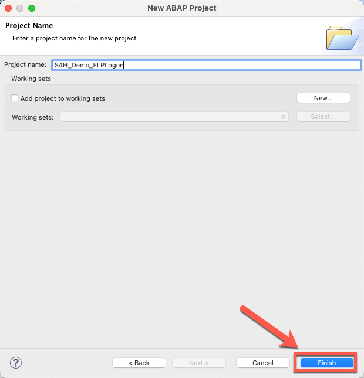

6. Once all steps are run you will find your new project in the **Project Explorer** section in ADT.

  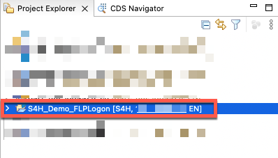

## Creating a development package

7. In **Project Explorer**, expand **Favorite Packages** and right-click on your recently created package structure. From the menu select **New >> ABAP Package**

  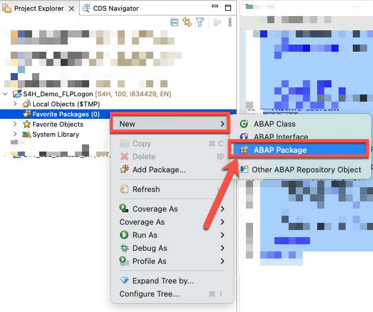

8. Enter the following information and click **Next**:
  * Name: **<< Your package name >>** (for example: ZCUSTOM_LOGON).
  * Description: **<< Your package description >>** (for example: FLP Custom Logon Page).
  * Add to favorite packages: **Active**
  * Superpackage: **<< NONE >>**
  * Package Type: **Development**

  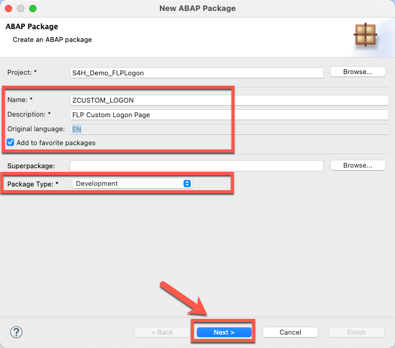

9. Enter the following information and click **Next**:
  * Software Component: **HOME>**

  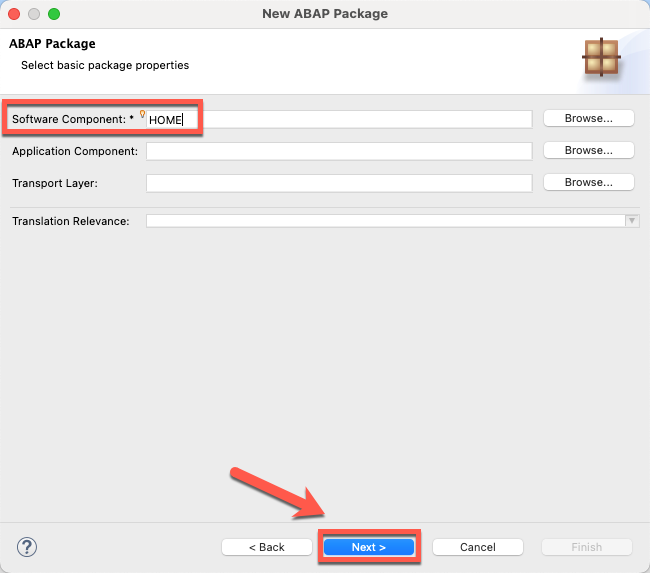

10. Select an existing transport request or create a new one to save your changes and click **Finish**

  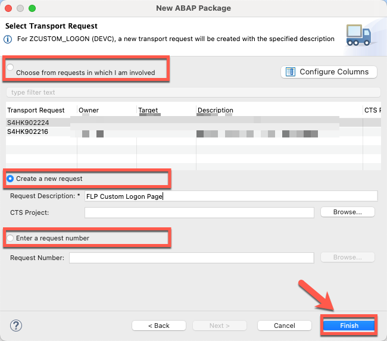

11. Once created, package details will be displayed in the screen.

  **NOTE** - the package should also be added yo your favorites list.

  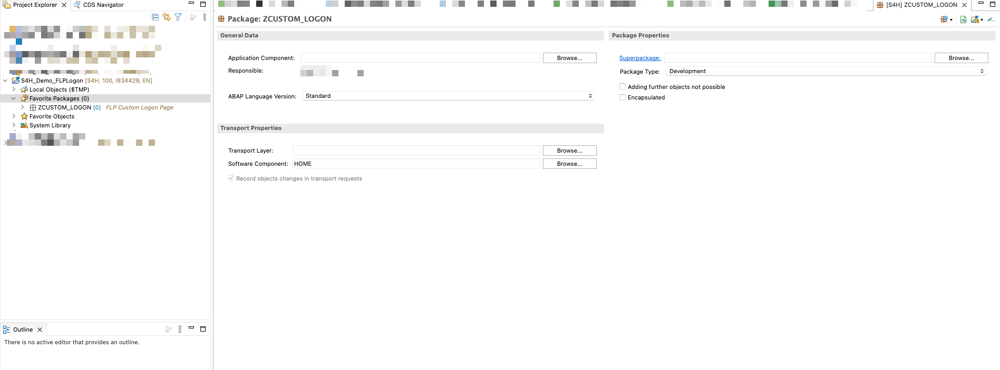

## Uploading images to MIME repository

12. Click on **Open SAP GUI** button, select your project and click **Ok**.

  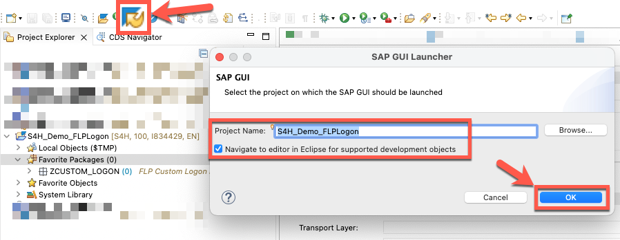

13. Run transaction **/nSE80**.

  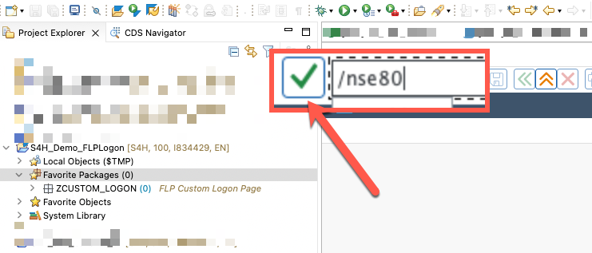

14. Open MIME repository.

  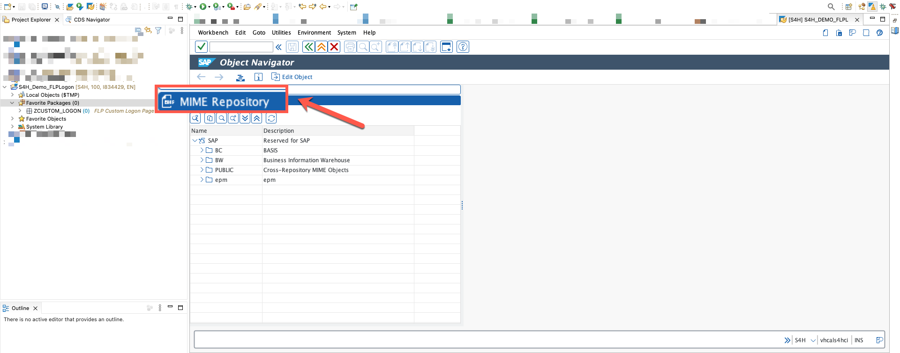

  **NOTE** - If you cannot see **MIME REpository** go to **Utilities >> Settings >> Workbench (General)**, select **MIME Repository** and click **Ok** button

  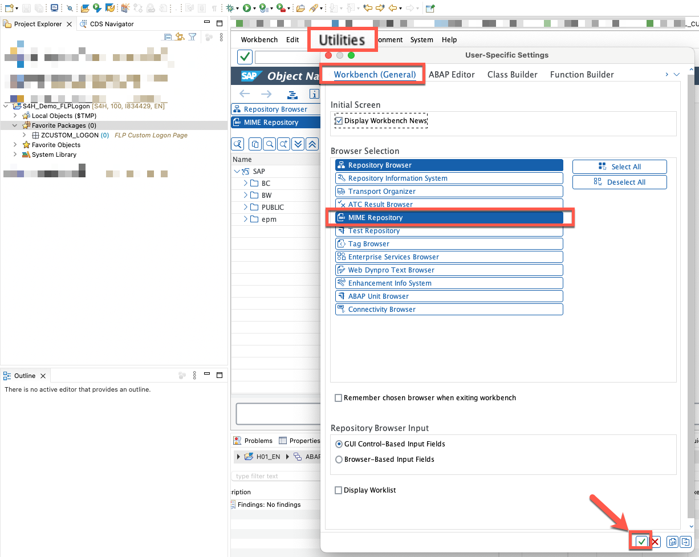

15. Navigate to path **SAP >> PUBLIC >> BC >> UI2 >> logon >> img**.

  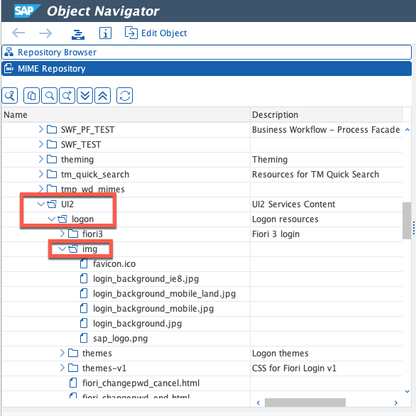

16. Right-click on folder **img** and select option **Import MIME Objects**

  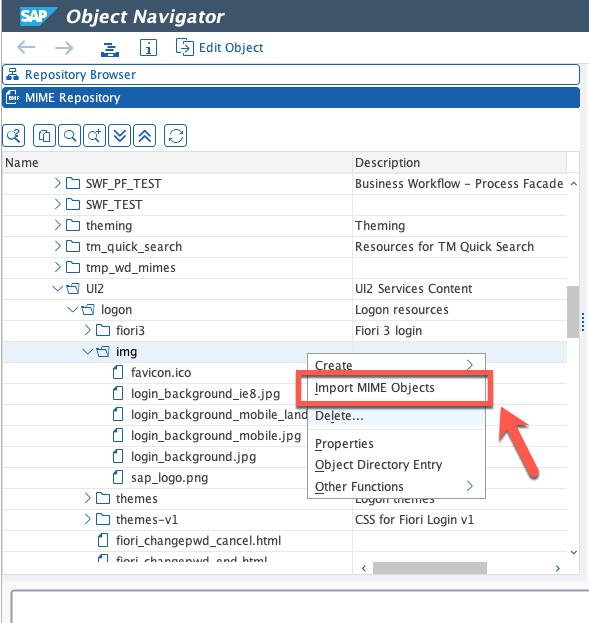

17. Download and open file [zcompany_icon.png](sources/zcompany_icon.png).

  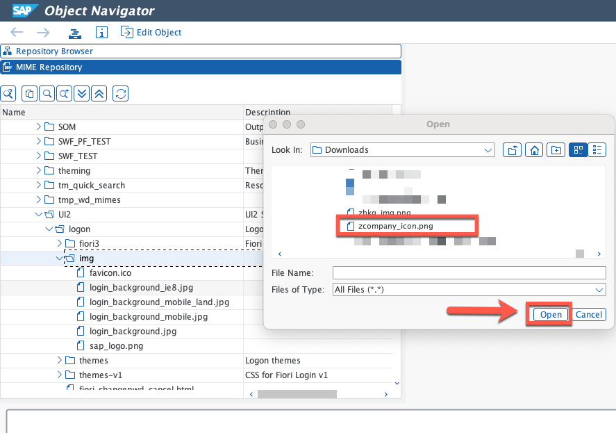

18. Use default values and click on **Save**. (This will import the file into the server)

  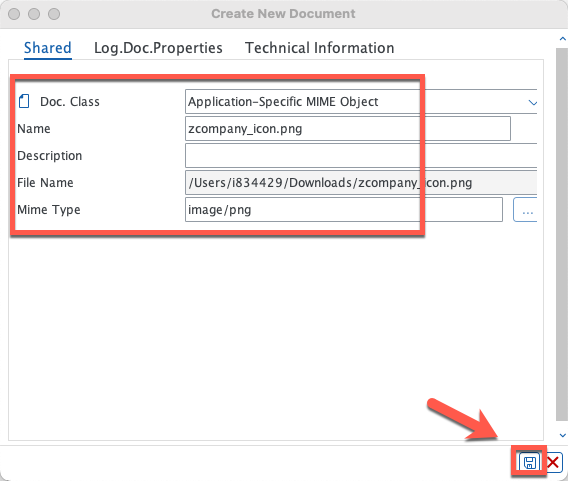

19. Enter the package where the objects will be stored (for example: ZCUSTOM_LOGON) and click on **Save**.

  

20. Select a transport request and continue.

  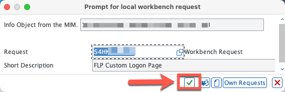

21. Wait for the upload to conclude. You should find your new file in the folder structure once upload is successful.

  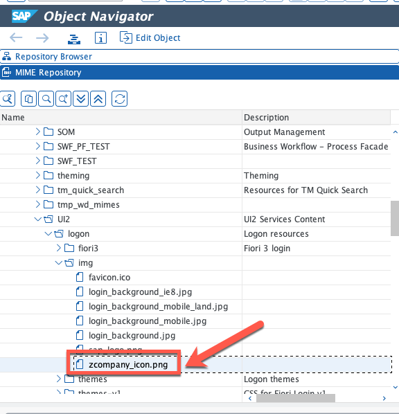

22. Repeat steps 16-21 for file [zbkg_img.png](sources/zbkg_img.png). You should find both files in the folder structure once upload is successful.

  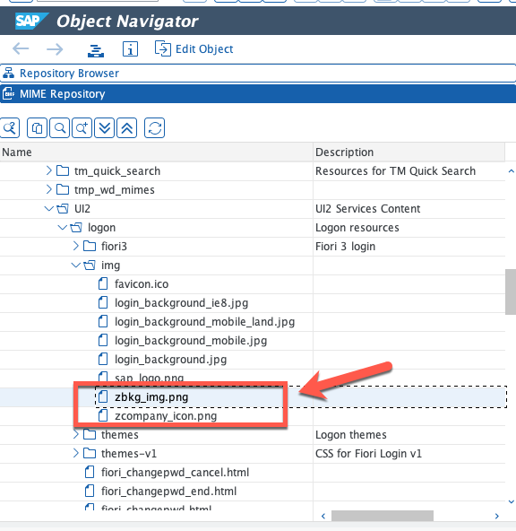

## Next Steps
In the next section you will create a custom BSP so you can test the logon class without disturbing end-users.

To continue with this exercise go to [Exercise 2](../ex_2)
