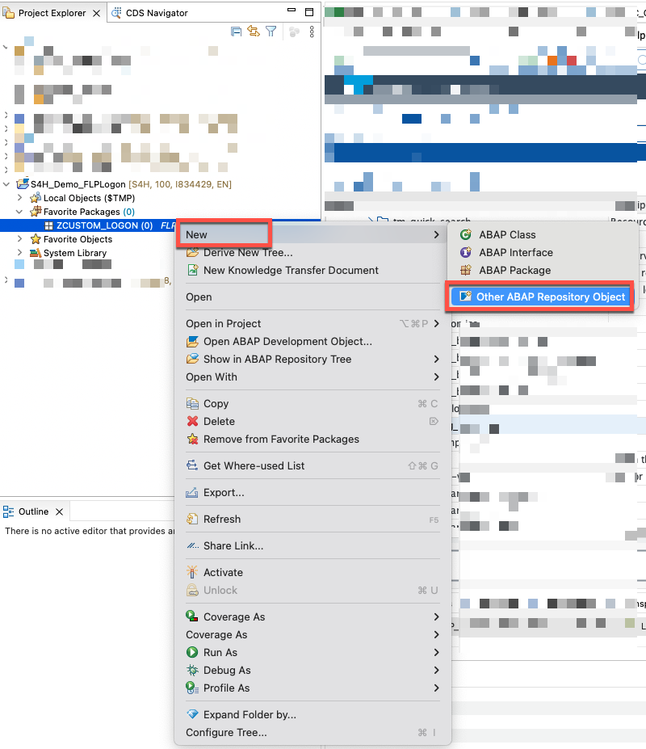
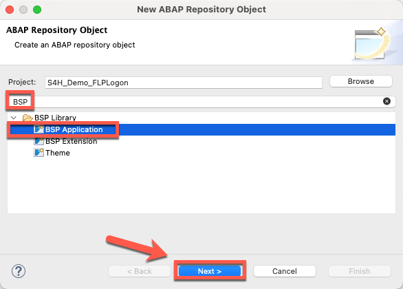
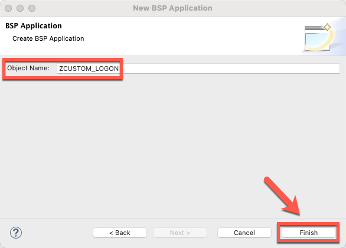
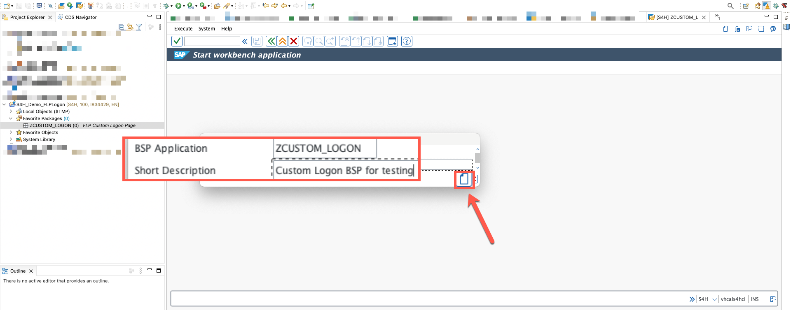
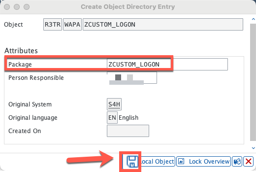
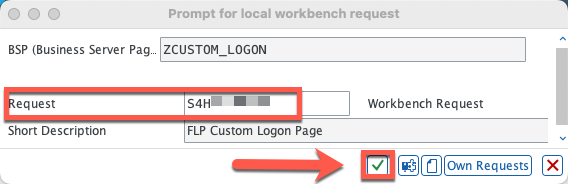
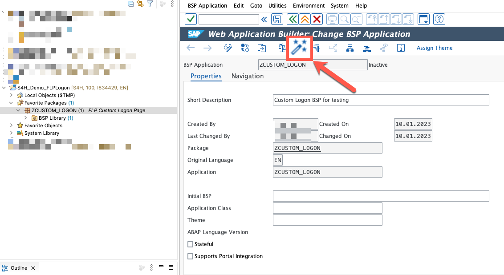
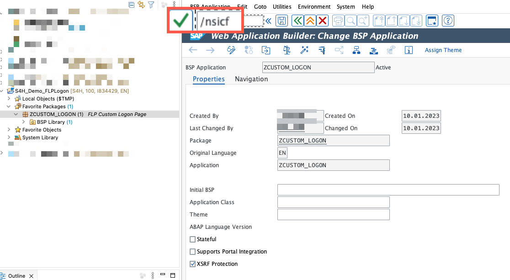
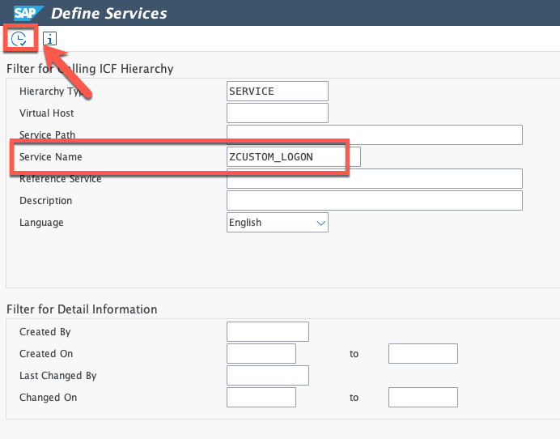
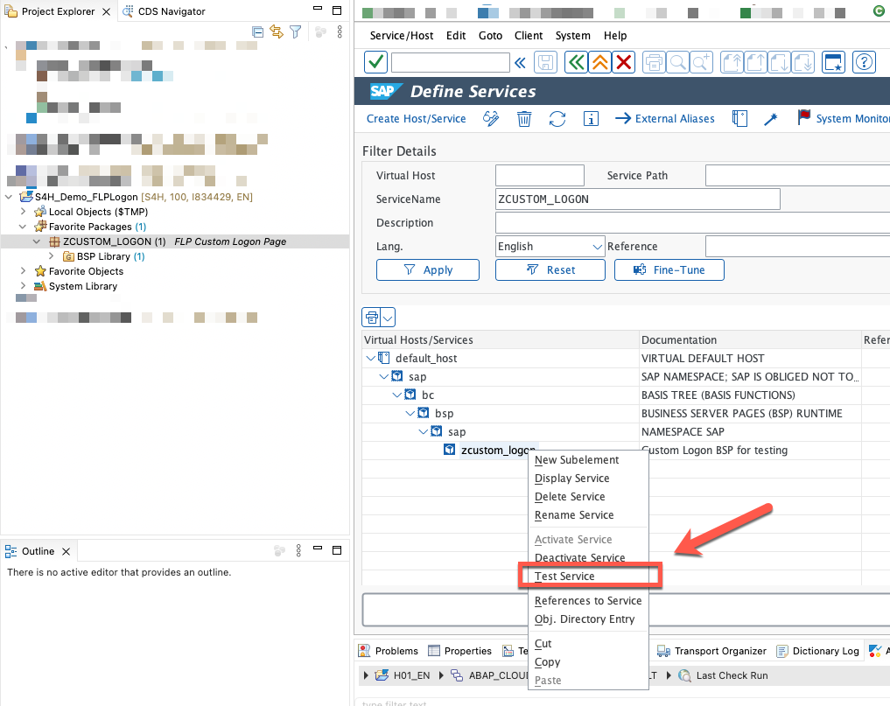

# (Optional) Creating a Custom BSP for Testing

## Description

In this section you will find the steps to create a test BSP page so you can try-out your custom login without disturbing end-users.  

## Create a BSP service for testing

23. In **Project Explorer**, right-click on your package and in the menu navigate to: **New >> Other ABAP Repository Object**.

  

24. Search for keyword **'BSP'**, select **BSP Application** from the list and click on **Next**.

  

25. Enter the following details and click **Finish**

  * Object Name:  **<< Your custom object name >>** (for example, **ZCUSTOM_LOGON**).

  

26. Enter the following details and click **Create**

  * Short Description:  **<< Your custom object description >>** (for example, **Custom Logon BSP for testing**).

  

27. Enter the package where the objects will be stored (for example: ZCUSTOM_LOGON) and click on **Save**.

  

28. Select a transport request and continue.

  

29. Activate your BSP page by clicking on the **Activate** button.

  

30. Run transaction **/nSICF**.

  

31. Search for your recently created object (for example: **ZCUSTOM_LOGON**).

  

32. Right-click on your service and from the menu, select **Test Service**.

  

  **NOTE** - DO NOT LOGIN if prompted for authentication, for now we only want to confirm the object is active.

  

## Next Steps
In the next section you will create a custom class to start adapting the logon page.

To continue with this exercise go to [Exercise 3](../ex_3)
