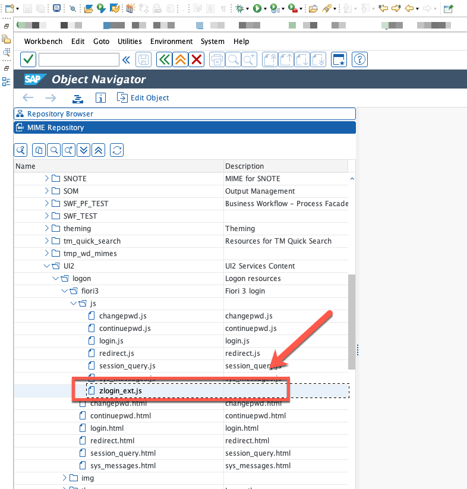
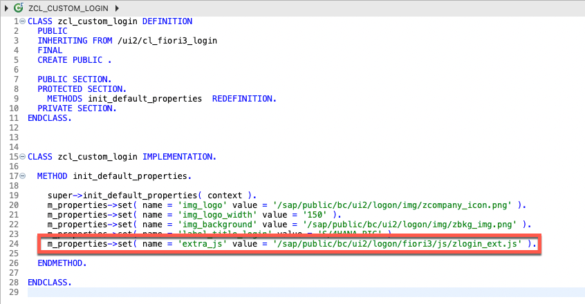
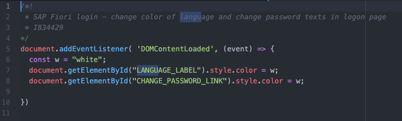
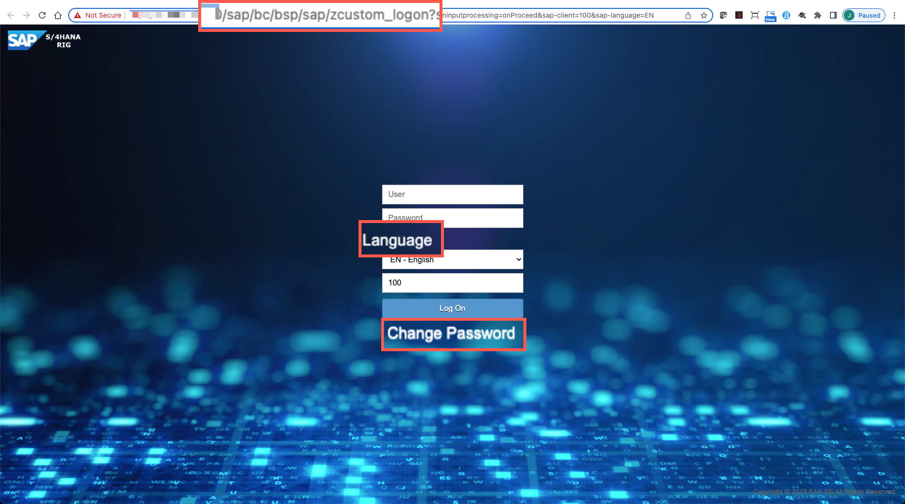

# Creating and calling custom Javascript

## Description

In this section you will find the steps to add custom javascript code to change the color of language and change password texts so the logon page is fully visible.

## Importing JS Code and adjusting ABAP class.

44. Download sample code [zlogin_ext.js](sources/zlogin_ext.js) and import it as a new **MIME object** in path **SAP >> PUBLIC >> BC >> UI2 >> logon >> fiori3 >> js**

  

45. Copy **ALL** code from the updated sample class [ZCL_CUSTOM_LOGIN](sources/ZCL_CUSTOM_LOGIN.ABAP) into your own class. **Save** and **Activate**

  

## What does this code do?

In this section you will find a brief explanation of the custom code you've added.

### zlogin_ext.js

  

  46. In this brief code, we are looking for the elements in DOM that belong to the Password and Change Password texts, once done, we are changing the text color to White.

### ZCL_CUSTOM_LOGIN - ABAP

  

  47. In this new version of the code we are only adding one line, where we tell the login procedure to include our javascript file, hence including our new custom logic.

## Testing the modifications.

48. Go back to your browser and refresh the BSP page. You should now see the new custom logon page and texts for "Language" and "Change Password" should be visible in white color

  

## Next Steps
In the next section you will your custom logon class to the SAP Fiori Launchpad.

To continue with this exercise go to [Exercise 5](../ex_5)
