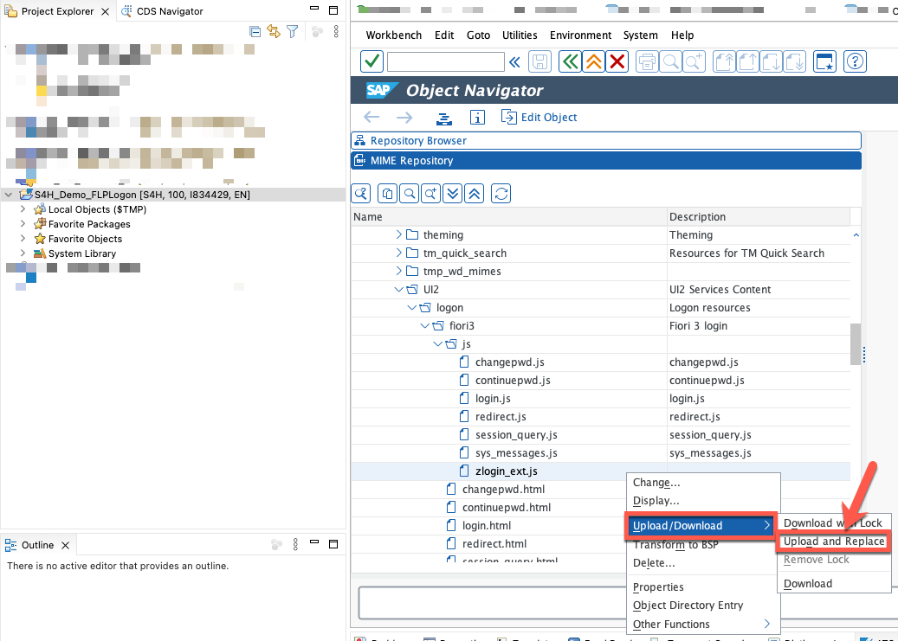
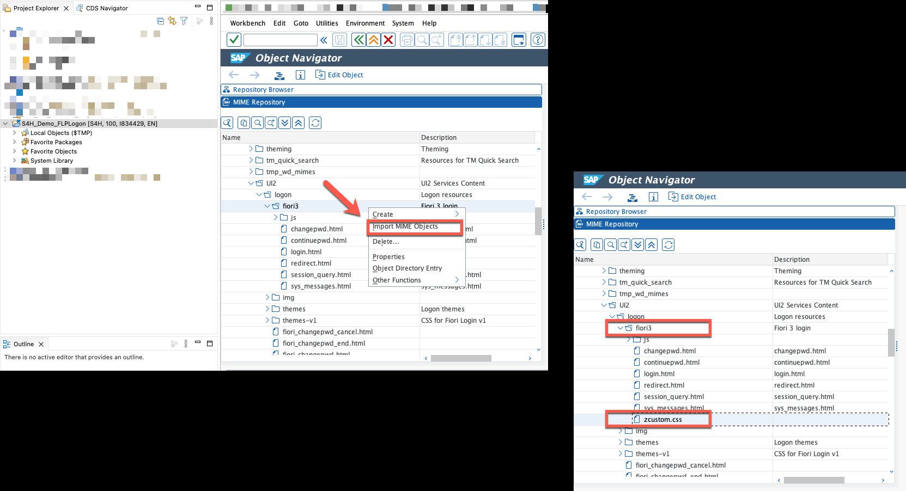
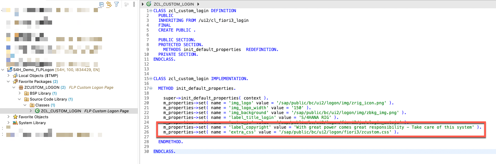
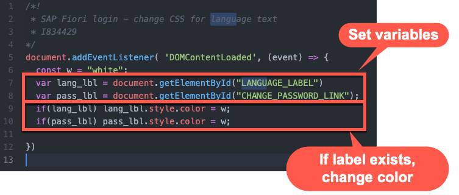
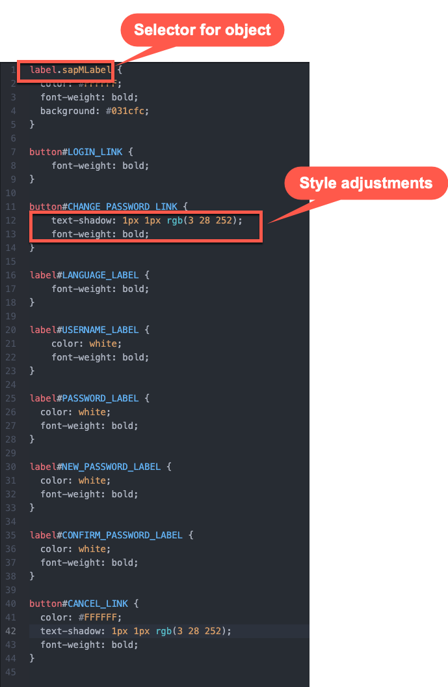
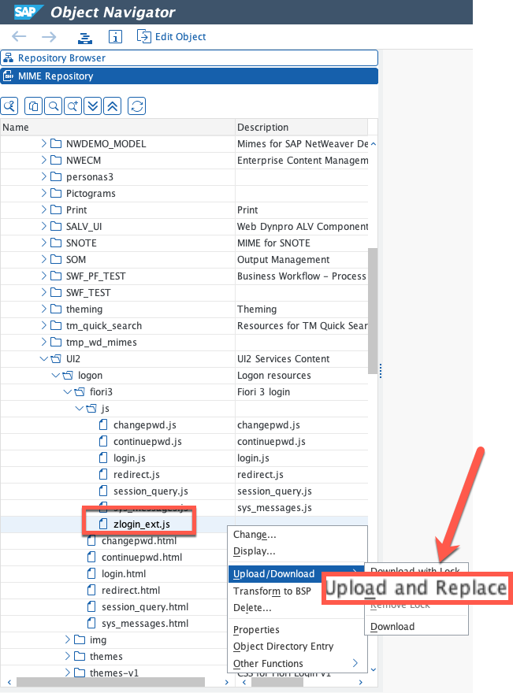

# Adjusting CSS, Copyright Text and Change Password Page

## Description

In this section you will find the steps to add custom CSS to your logon page and adjust the copyright text.

## Importing JS Code, CSS classes and adjusting ABAP class.

49. Download sample code [zlogin_ext.js](sources/zlogin_ext.js) and replace the existing **MIME object** in path **SAP >> PUBLIC >> BC >> UI2 >> logon >> fiori3 >> js**

  

50. Download sample code [zcustom.css](sources/zcustom.css) and import it as a new **MIME object** in path **SAP >> PUBLIC >> BC >> UI2 >> logon >> fiori3**

  

51. Copy **ALL** code from the updated sample class [ZCL_CUSTOM_LOGIN](sources/ZCL_CUSTOM_LOGIN.ABAP) into your own class. **Save** and **Activate**

  

## What does this code do?

In this section you will find a brief explanation of the custom code you've added.

### zlogin_ext.js

  

  52. In this updated code we are first validating that the elements in DOM that belong to the Password and Change Password texts exists, once we confirm they exist, we are changing the text color to White.

### zcustom.css

  

  53. In this custom CSS, we are defining the style of each of the elements by setting the selector name of the objects and specifying the styles for color, text shadows and font weights to each one of the objects in the screen. This way we override the standard styles.

### ZCL_CUSTOM_LOGIN - ABAP

  

  54. In this new version of the code we are adding two lines, the first one, where we change the text in the copyright section and the second, where we indicate the logon page to load our custom CSS library.

## Testing the modifications

55. Go back to your browser and refresh the BSP page, switch to change password screen and all label texts should be in white color. You should also find a custom text in the copyright section.

  

## Next Steps
In the next section you will deploy your custom logon class to the SAP Fiori Launchpad.

To continue with this exercise go to [Exercise 6](../ex_6)
