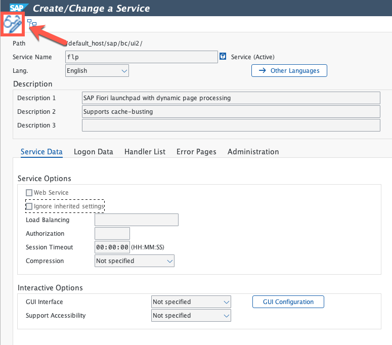
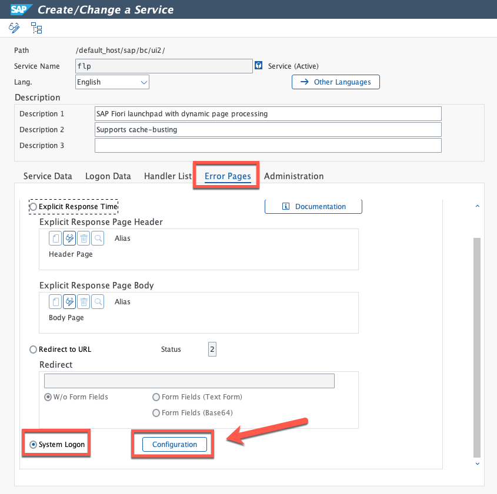
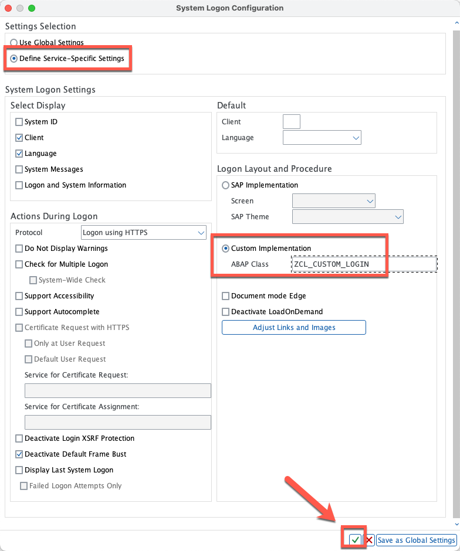

# Deploying your custom SAP Fiori Launchpad logon page

## Description

In this section you will find the steps on how to activate your custom logon class for the SAP Fiori Launchpad now that you have made sure that everything works correctly

## Adjusting the SAP Fiori Launchpad logon page

56. In transaction SICF, search for **Service Name = "FLP"** and double click on the entry.

  

57. Once displayed, switch to **Edit** mode.

  

58. Navigate to **Error pages**, activate the **System Logon** radio button and click on **Configuration**

  

59. In the **System Logon Configuration** menu, activate radio button: **Define Service-Specific Settings** followed by activating radio button **Custom Implementation** and entering the name of your custom class (for example: **ZCL_CUSTOM_LOGIN**). Once done, click on **Ok** button and accept all messages.

  

60. Once changes have been done, click on **Save**.

  **NOTE** - You will be prompted for a transport request

  

61. Logon to the Fiori Launchpad, you should now see the new custom logon page.

  * Launchpad URL: **https://< your_system_host >:< your_system_port >/sap/bc/ui2/flp**
  * Launchpad transaction: **/n/UI2/FLP**

  

## How to adapt to your own images or updating CSS classes and JS code?

If you've reached this section you are probably wondering how you could adapt the content to show your own background and company logos or how to adapt the custom JS code if needed. Fortunately, this is very easy as you can adapt the ABAP code as needed and for the images and JS code you can update the code and images by using the "Upload and Replace" feature in the MIME repository browser from transaction SE80.

  

We hope you enjoyed this step-by-step document!
